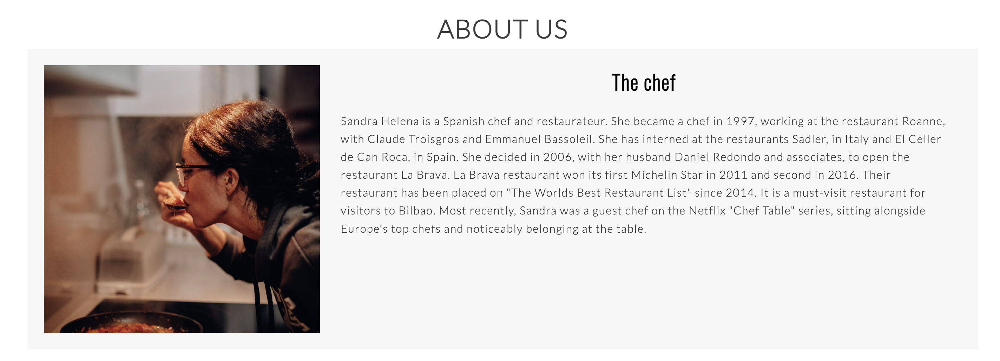
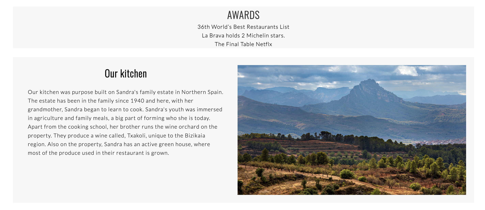
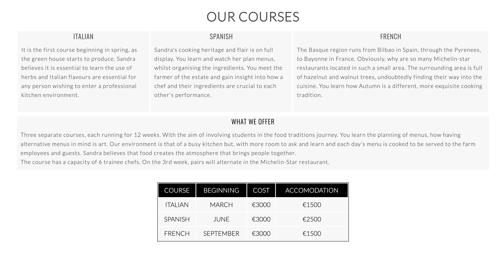
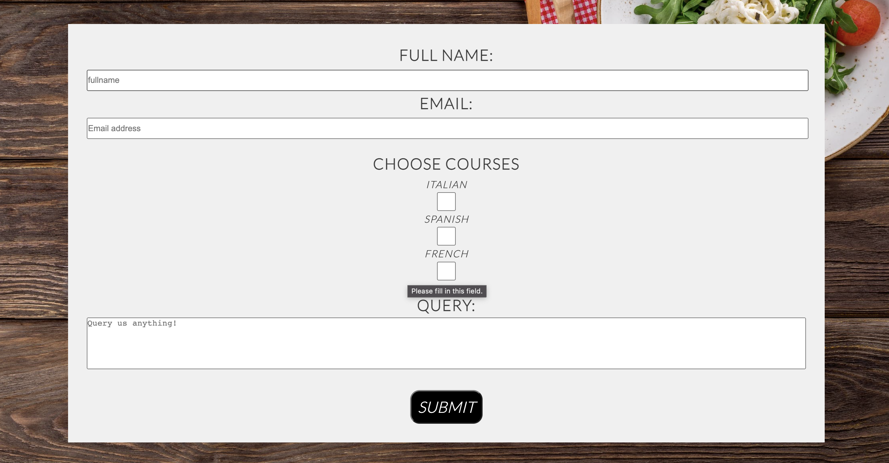
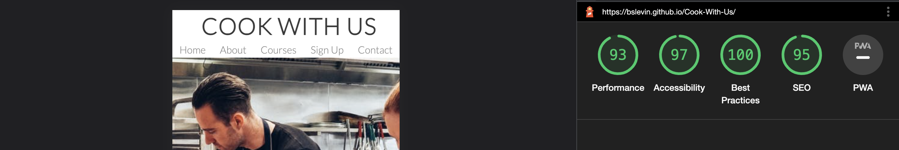

# Cook With Us
## Site overview 
### Fictional website

> Cook with Us is 3 individual cooking courses, run throughout the year in Northern Spain. The host is a an established chef whose restaurant holds 2 Michelin stars.
> The site is aimed at knowledgeable students, as it offers the opportunity to learn with this established Chef in a personalised environment. 
> The website is an area to showcase what the course entails, for those who are curious to learn from this Chef.

## **[Live Site](https://bslevin.github.io/Cook-With-Us/)**

------------------------------------------------------------------

## **[Repository](https://github.com/bslevin/Cook-With-Us)**

-----------------------------------------------------------------

## Table of contents

 1. [ Design ](#design)
 2. [ Features ](#features) 
 3. [ Technology](#tech)  
 4. [ Testing ](#testing)   
 6. [ Bugs ](#bugs)   
 7. [ Deployment](#deployment)  
 8. [ Credits](#credits)  
 

 

# Design

 ## Project planning
 > I have a passion for cooking and thought it best to incorporate that passion for the project.
 
 ## UX
 > In approaching this project, I started by determining both the user and business interests.

 ### User
> As a user, I want to be able to train in a professional cooking environment.  
> As a user, I want to be able to see the environment.  
> As a user, I want to be able to see accolades of the owner.  
> As a user, I want to be able to see the courses on offer.
> As a user, I want to be able to request information from the business.

### Business Owner
> As the site owner, I want to showcase the business to prospective customers.  
> As the site owner, I want to showcase the unique business and it's oportunities to students.  
> As the site owner, I want to customers to query about the course.  
> As the site owner, I want to the website to establish itself as a profeesional cooking school. 
> As the site owner, I want to the website to gather information for future business growth. 

### Scope Plane
> The website should have a navigation menu that is consistent across all devices.  
> The website should have a message for the user explaining what it is.  
> The website should encourage the user to scroll and find out more about the business.   
> The website should include information regarding each course.
> The website should give the user a way of sellecting each course through a form.
> The website should include information as to cost, accomodation and start dates of each couse. 

## Structure
> To acheieve the goals of the above, the website should include at least 5 section consisting of:  Home, About Us, Our Courses, Sign Up and Contact.

### Wireframes

### Home Page Desktop Wireframe

### Home Page mobile wireframe

> The flow of the website was to be of minimal design. Providing relevant information in a consistent format equally on all devices.  
> As the project was created, upon advise the initail project had to be altered as visualy the project was not pleasing.

## Page apearence 

### Color
> For a minimal appearence the below colors were chosen.

 - #3a3a3a  -   Background-color
 - #ffffff  -   White
 - #000000  -   Black

> On advice I removed all text sitting over imgages leaving only the hero text.

### Images
> The aim of the images chosen was to visualy intice the viewer into wanting more information.

### Typography - 
> H3 headings are purposfuly used to capture the veiwers attention.

> The font's chosen for this project were:
 - Lato
 - Oswald
> They are visibly pleasing and suited the minimal style I was going for.
-----------------------------------------------------------------

# FEATURES

## Navigation
> Top left of the landing page is a H1 headding 'Cook With Us', this is used as the logo. 
> Top right of the page holds five menu navigations, Home, About, Our Courses, Sign-up and Contact. They link to the relevant section of the page.
> Logo H1 uses the Lato font and Nav menu use Oswald font, complimenting eachother nicely.

## Hero section
> The hero image was taken Pexel.com.
> The image is of two people working alongside eachother in a professional kitchen.
> A hero text uses an opaque background the width of the scree, text color #fff.
> The hero-text is used to explain the site and entice the users attention.

## About Us
> The about us section introduces the user to the Chef and founder of the bussiness, her accolades and the venue where the courses take place. 
> This is an importamnt section to validate users who have searched for the site.
> It showcase the level of expertise of the owner brings to the business.
> The uniqness if the venue where the bussines has been purposfuly built.

> Done in 3 sections
- 1 Introduction to chef 
- 2 Awards connected to the chef
- 3 Introduction to the venue of the Kitchen. This section is as unique as is the oportunity to learn with the chef.

## Our Courses

> The Courses section is abroken down into:
- The individual courses and a introduction to what is entailed in each course.
- What the business has to offer, it's uniquness and the oportunity it supplies the trainee.
- A table to give information regarding each course; begginging date, cost per course & the cost of accomadation.

## Sign Up

> The Sign Up section is made of a image for the background and the form sits inside it
- backround color with little opaque applied.
> Checkboxes are used to allow users mulitselect the courses that interst them.
> Textarea gives the user the option to ask questions.
> As a new bussiness the data request for information will be assesed for future course scheduling.

### Contents of Sign Up form
- Full Name and Email placeholder and required added.
- 3 Checkboxes representing each course, checkbox used for multi select,
- A query textarea. Placeholder and no resize added.
- Submit button whit :hoover color blue.

## Contact section

> Short section conatining social media links and Address. 
- Social media links
- Address

-----------------------------------------------------------------
# Testing

## Testing
---

- I tested this page work in different browsers: Chrome Firefox & Microsoft Edge.
- I confirm this project is responsive, looks good and functions on all standard screen sizes using the DevTools device toolbar.
- I confirmed that the navigation, H1, and H2 are visibly recognisable.
- I confirmed that the form works. It requires entries in required field and the submit button works.

**Testing navbar links, social media and Form**
> All links on Navbar lead to the correct section.

> Social media links in the footer lead to their respective social media sites.

> Sign Up form submits when all criteria is filled correctly.

### Validator Testing

- HTML

- CSS

- Accessibility

I confirmed that the colors and fonts chosen are easy to read and accessible by running lighthouse in DevTools.

-----------------------------------------------------------------
# Bugs

> Issue with sections feeling bunched together. **fixed**

> Added flex to the about us section. **fixed**

> The form of the Sign Up section would overlap in landscape mode. **fixed**

> Error on style.css line 559. **fixed**

-----------------------------------------------------------------
# Deployment

> To deploy the project I followed these steps starting from the main project repository [here](https://github.com/bslevin/Cook-With-Us).

 1. Clicked `Settings` on the navigation menu of the repository
 2. Then selected the `Pages` menu on the side bar.
 3. In the first dropdown menu labeled `Source` I selected the branch of the name `main` from the dropdown.
 4. In the next dropdown labeled `/root` I left as the default option.
 5. Selected Save
 
> GitHub sent a notifcation the project was being deployed and after about 1 minute the page was live.

-----------------------------------------------------------------
# Technology Used

### Html
> Used to structure the webpages.

### CSS
> Used to style and add layout to the project.

### Font Awesome
> Used for social media icons in the project

### GoogleFonts
> Used for the fonts used in the project.

### Canva
> Used to create the favicon logo.

-----------------------------------------------------------------

## Credits

- Traversy Media tutorials on CSS and Flexbox.
- Dev Ed tutorials.
- Web Dev tutorials helped with the navbar issue I was having.
